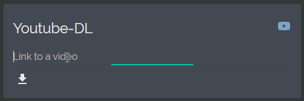

# youtube-dl-card
This custom card for HomeAssistant lets you download videos with youtube-dl to a remote machine with just one click (and one link paste).\
\

## How does it work?
This card utilizes Home Assistant's [Shell Command](https:/www.home-assistant.io/integrations/shell_command/) integration to execute a [youtube-dl](https://ytdl-org.github.io/youtube-dl/index.html) command on a remote machine using [SSH](https:/www.ssh.com/ssh/). Backwards communication is handled by posting information to Home Assistant's [REST API](https:/developers.home-assistant.io/docs/api/rest/) using [cURL](https:/curl.haxx.se/).

# Installation

This card requires several components to work properly. Here is a instruction on how to set it up:

1. [Remote machine](#remote-machine)  
2. [youtube-dl](#youtube-dl-configuration)  
3. [SSH configuration](#ssh)
4. [Script](#script)  
5. [Shell Command](#shell-command)  
6. [Communication Sensor](#communication-sensor)  
7. [Downloading card code](#downloading-card-code)  
8. [Card configuration](#card-configuration)

## 1. Remote machine
Your remote machine is the one that the card will download videos to. Most often it is a NAS. If you run Home Assistant dockerized, you can use this card to download videos on a host system or a system in other container (just provide adequate ip address and/or port number in [card configuration](#card-configuration)).
## 2. youtube-dl configuration
Install [youtube-dl](https://ytdl-org.github.io/youtube-dl/index.html) on your remote machine. Since this card does not support passing arguments to youtube-dl command (for format selection etc.) they must be inserted in a config file.  
If you use Linux and only plan on downloading videos from YouTube I recommend creating `/etc/youtube-dl.conf` containing
```
-f bestvideo+bestaudio/best
-o path/%(title)s.%(ext)s
```
where `path` should be replaced with location that you want to download videos to.  
Please refer to [youtube-dl documentation](https://github.com/ytdl-org/youtube-dl/blob/master/README.md#configuration) for more information about configuration and config file locations on other operating systems.   

## 3. SSH configuration
## 4. Script
## 5. Shell Command
## 6. Communication Sensor
## 7. Downloading card code
## 8. Card configuration

# Credits